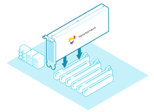

# Home

Tenstorrent produces add-in boards, system solutions, APIs, IP, and more featuring our Tensix Core and RISC-V architectures to accelerate machine learning and AI workloads. Our documentation for those technologies is available here.

## Add-In Boards and Cooling Kits

Documentation and support for Tenstorrent add-in boards and the Active Cooling Kit:

Documentation and support for Tenstorrent add-in boards and the Active Cooling Kit:

- **e75/e150 Machine Learning Accelerator**
- **Active Cooling Kit**

## Workstations and Server Systems

Physical and software setup for Tenstorrent workstation and server solutions:

- [**Galaxy 4U Server**](./galaxy4U/README.md)

  

## APIs, SDKs, and Software

### TT-Buda

Documentation for Tenstorrent's high level API is **here**.

### TT-Metalium 

Documentation for Tenstorrent's open source, low level API is **here**.

 

### Software and Utilities

Documentation and downloads for drivers, software, and utilities to manage Tenstorrent hardware is **here**.

## Support

For additional help with or information about Tenstorrent's technologies, please contact

[]: support@tenstorrent.com	"support@tenstorrent.com"

  or visit our 

[Discord]: https://discord.gg/tvhGzHQwaj

.
