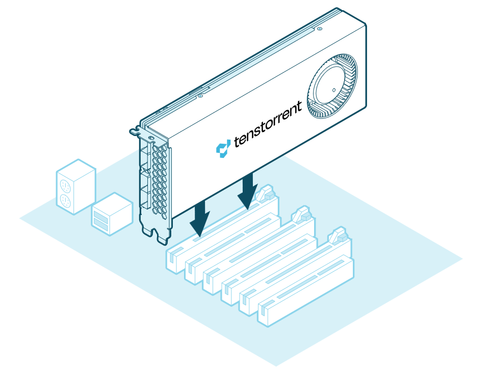
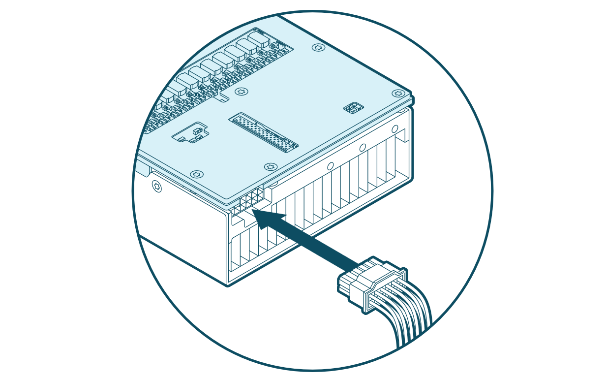

# Hardware Installation

Follow these instructions to install your Tenstorrent Blackhole™ p100a/p150a/p150b add-in board.

1. [Pre-Installation](#pre-installation)
2. [Desktop Workstation](#desktop-workstation-installation)
3. [Connecting Power](#connecting-power)
4. [Software Setup](#software-setup)

## Pre-Installation

1. **Disconnect power** to the host computer prior to installation.
2. Verify that the system provides the following:
   1. **PCI Express 5.0 x16 slot** 
      1. For optimal performance, the card requires a x16 configuration without bifurcation.
      2. The p100a and p150a are dual-slot width cards with active coolers; it is recommended to leave the adjacent slot unoccupied to ensure best airflow.
      3. The p150b is a dual-slot width card with a passive heatsink intended for rack-mounted systems with sufficient active airflow.
   2. **ATX 3.1 Certified power supply or better**; using an older or otherwise inadequate power supply may result in stability issues.
   3. One (1) **12+4-pin 12V-2x6 power connector**
3. Discharge your body's static electricity by wearing an **ESD wrist strap** *(recommended)* or touching a grounded surface before touching system components or the add-in card.

## Desktop Workstation Installation (p100a/p150a)

*(NOTE: Images shown may not be fully representative of your system.)*

Insert the **card** into the **PCIe x16 slot** and secure with necessary screws. *(p150a pictured.)*

## Connecting Power

Connect a **12+4-pin 12V-2x6 power cable** to the plug on the back of the card. **Ensure the cable is fully and securely connected.**

## Software Setup

Instructions on how to set up software on your p100a/p150a/p150b are available [here](https://docs.tenstorrent.com/getting-started/README.html).
