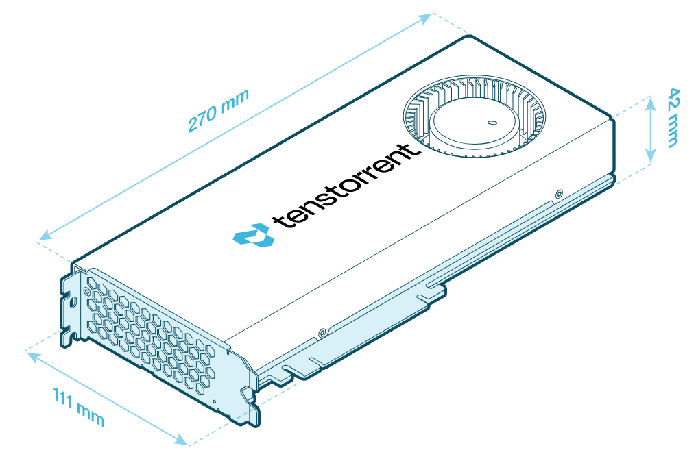
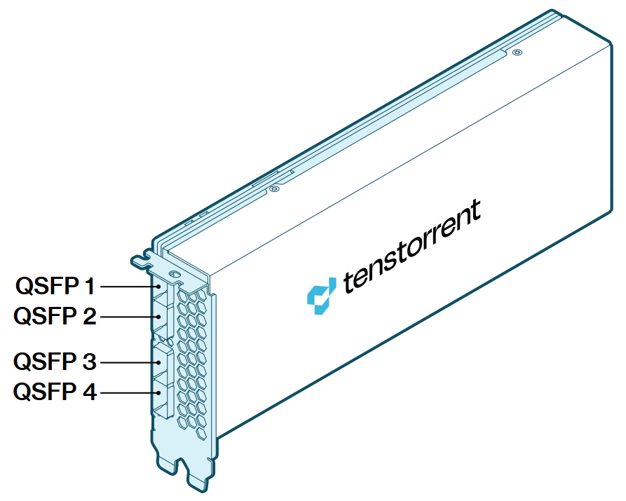

# Specifications/Requirements

## Blackhole™ Tensix Processor

The Blackhole™ p100a, p150a, and p150b Tensix Processor add-in boards are built using the Tenstorrent Blackhole™ Tensix Processor:

- **Tensix Core Count:** 140
- **SiFive x280 "Big RISC-V" Cores:** 16
- **SRAM:** 210 MB (1.5 MB per Tensix Core)
- **Memory:** 32 GB GDDR6, 256-bit memory bus

## Card Comparison Table

**NOTE:** The **p100a** and **p150a** add-in cards are designed for desktop workstations where active cooling is required. For rack-mounted servers with sufficient forced air cooling, use the **p150b** add-in card.

| Specification             | p100a                       | p150a                       | p150b                       |
| ------------------------- | --------------------------- | --------------------------- | --------------------------- |
| Part Number               | TC-03008                    | TC-03003                    | TC-03002                    |
| Tensix Cores              | 120                         | 140                         | 140                         |
| AI Clock                  | Up to 1.35 GHz              | Up to 1.35 GHz              | Up to 1.35 GHz              |
| "Big RISC-V" Cores        | 16                          | 16                          | 16                          |
| SRAM                      | 180 MB                      | 210 MB                      | 210 MB                      |
| Memory                    | 28 GB GDDR6                 | 32 GB GDDR6                 | 32 GB GDDR6                 |
| Memory Speed              | 16 GT/sec                   | 16 GT/sec                   | 16 GT/sec                   |
| Memory Bandwidth          | 448 GB/sec                  | 512 GB/sec                  | 512 GB/sec                  |
| TBP (Total Board Power)   | 300W                        | 300W                        | 300W                        |
| External Power            | 1x 12+4-pin 12V-2x6         | 1x 12+4-pin 12V-2x6         | 1x 12+4-pin 12V-2x6         |
| Power Supply Requirements | ATX 3.1 Certified or better | ATX 3.1 Certified or better | ATX 3.1 Certified or better |
| Connectivity              | -                           | 4x QSFP-DD 800G (Passive)*  | 4x QSFP-DD 800G (Passive)*  |
| System Interface          | PCI Express 5.0 x16         | PCI Express 5.0 x16         | PCI Express 5.0 x16         |
| Cooling                   | Active                      | Active                      | Passive                     |
| Dimensions (WxDxH)        | 42mm x 270mm x 111mm        | 42mm x 270mm x 111mm        | 42mm x 270mm x 111mm        |

**For connecting to Tenstorrent Blackhole™-based cards only.*

### Card Dimensions

#### p100a

#### p150a

#### p150b

## Connectivity (p150a/p150b)

Blackhole™ cards feature four ports for connecting to other cards. *(p150b pictured; p150a will have the same ports.)*

The four (4) QSFP-DD ports are passive, with each providing 800 Gbps connectivity and able to support cable length of up to 2m/6.5 ft. These ports are strictly for connecting Blackhole™-based cards.

## Data Precision Formats

The Blackhole™ Tensix Processor supports the following data precision formats:

| Format               | Bit Depth (Tensix Cores)                    | Bit Depth (Big RISC-V Cores)    |
| -------------------- | ------------------------------------------- | ------------------------------- |
| Floating point       | FP8, FP16, BFLOAT16 FP32 (Output Only) | FP8, FP16, BFLOAT16, FP32, FP64 |
| Block floating point | BLOCKFP2, BLOCKFP4, BLOCKFP8                | -                               |
| Integer              | INT8 INT32 (Output Only)               | INT8, INT16, INT32, INT64       |
| Unsigned Integer     | UINT8                                       | -                               |
| TensorFloat          | TF32                                        | -                               |
| Vector               | VTF19, VFP32                                | VFP64                           |

## Minimum System Requirements

| Part                | Requirement                                                  |
| ------------------- | ------------------------------------------------------------ |
| CPU                 | x86_64 architecture *CPU core count and number of sockets will depend on the amount of host preprocessing and post-processing required before and after the accelerator processing.* |
| Motherboard         | PCI Express 5.0 x16 slot Dual-slot width *Cards can function in slots with reduced connectivity at potentially reduced performance.* |
| Memory              | 64 GB                                                        |
| Storage             | 100 GB (≥2 TB recommended)                                   |
| Power Connectors    | 12+4-pin 12V-2x6                                             |
| Total Board Power   | Up to 300W                                                   |
| Power Supply        | ATX 3.1 Certified or better                                  |
| Operating System    | Ubuntu version 22.04 (Jammy Jellyfish) *To check your version, type `cat /etc/os-release`*. |
| Internet Connection | Required for driver and stack installation.                  |

## Environment Specifications

The Blackhole™ Tensix Processor add-in boards are designed to meet these environmental specifications:

| Specification               | Requirement               |
| --------------------------- | ------------------------- |
| Operating Temperature Range | 10°C/50°F - 35°C/95°F     |
| Storage Temperature Range   | -40°C/-40°F - 75°C/167°F  |
| Elevation                   | -5 ft. to 10,000 ft.      |
| Air Flow                    | ≥30 CFM @ up to 35°C/95°F |

