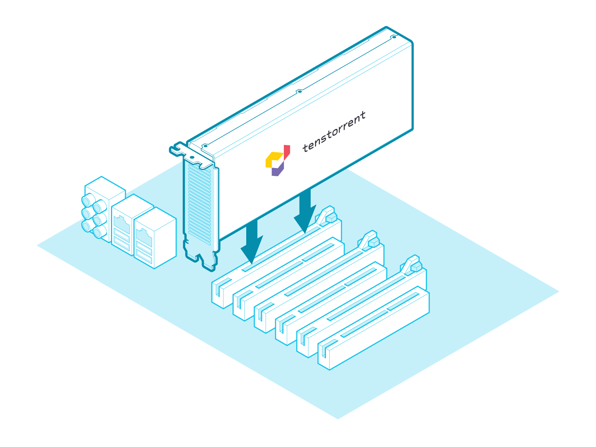
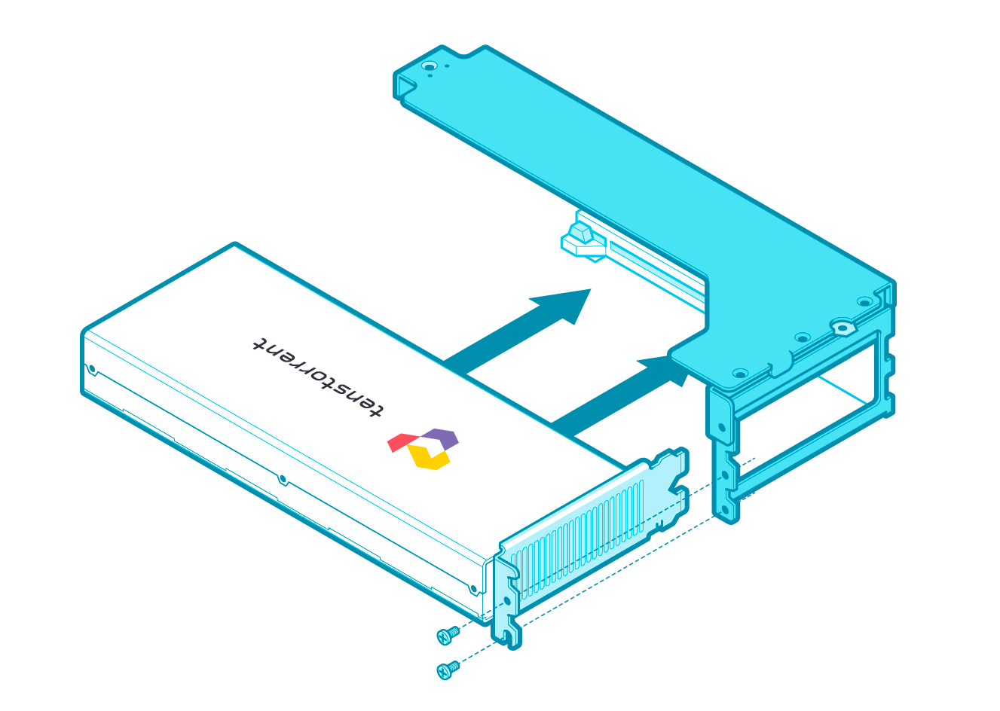
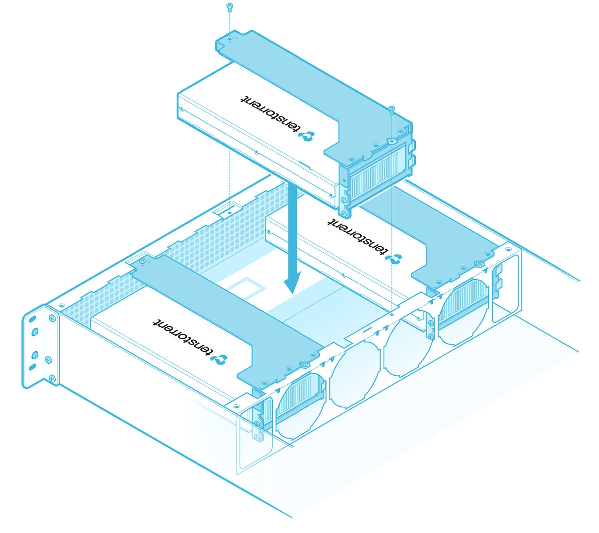
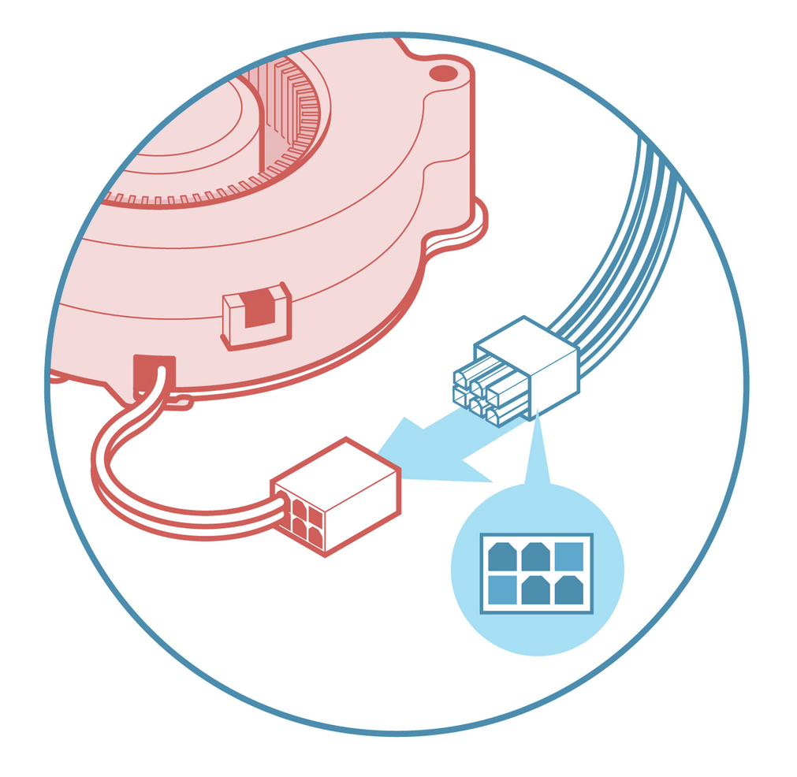
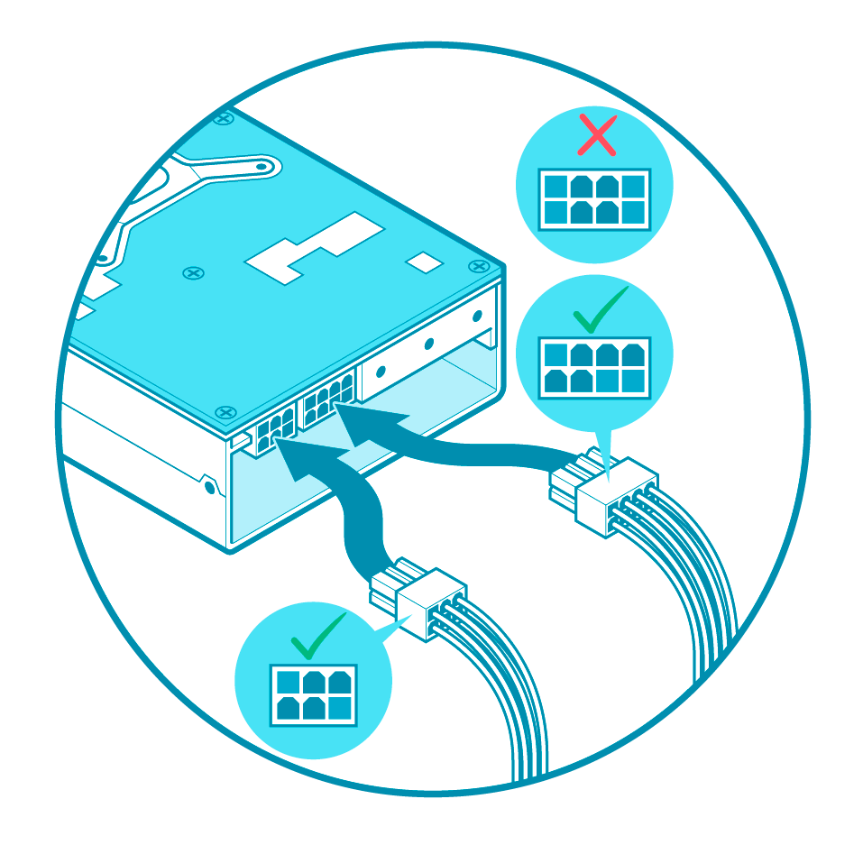
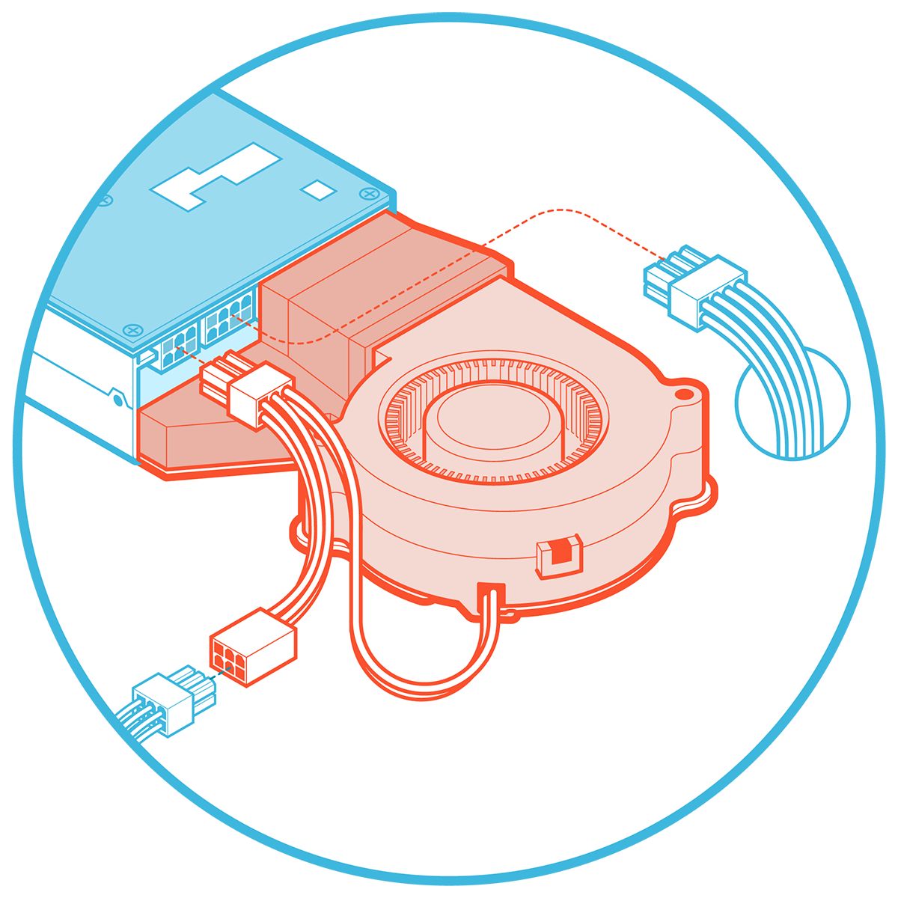

# Hardware Installation

Follow these instructions to install your Tenstorrent Grayskull™ e75/e150 Tensix Processor add-in board.

1. [Pre-Installation](#pre-installation)
2. System Installation
   - [Desktop Workstation](#desktop-workstation-installation)
   - [Server](#server-installation)
3. [Connecting Power](#connecting-power)
4. [Software Setup](#software-setup)

## Pre-Installation

1. **Disconnect power** to the host computer prior to installation.
2. Verify that the system provides the following:
   1. **PCI Express 4.0 x16 slot** *(For optimal performance, the card requires a x16 configuration without bifurcation. The e150 is a dual-width card and requires the adjacent expansion slot to be vacant.)*
   2. One (1) **PCIe 6-pin power connector**
   3. One (1) **PCIe 6+2-pin power connector** *(e150 only)*
3. Discharge your body's static electricity by wearing an **ESD wrist strap** *(recommended)* or touching a grounded surface before touching system components or the add-in card.

## Desktop Workstation Installation

*(NOTE: Images shown may not be fully representative of your system.)*

### Physical Installation

Insert the **card** into the **PCIe x16 slot** and secure with necessary screws.

## Server Installation

*(NOTE: Images shown may not be fully representative of your system.)*

### 1. Attach Housing

House the **card** in the **casing**.

### 2. Card Installation

Lower the **encased card** into the **chassis** and secure with the required screws.

## Connecting Power

### e75

Connect a **6-pin PCIe power cable** to the **6-pin plug** attached to the blower fan.

### e150 (No Active Cooling Kit)

Connect an **6+2-pin PCIe power cable** to the **8-pin plug** and a **6-pin PCIe power cable** to the **6-pin plug** on the **e150 card**. *(NOTE: Do* ***not*** *connect an 8-pin EPS12V power cable to the 8-pin port on the card.)*

### e150 (With Active Cooling Kit)

Connect a **6+2pin PCIe power cable** to the **8-pin plug** on the **e150 card**. *(NOTE: Do* ***not*** *connect an 8-pin EPS12V power cable to the 8-pin port on the card.)* Connect a **6-pin PCIe power cable** to the **female 6-pin plug** of the **fan harness**, then connect the **male 6-pin plug** of the **fan harness** to the **6-pin plug** of the **e150 card**.

## Software Setup

Instructions on how to set up software on your e75/e150 are available [here](https://docs.tenstorrent.com/getting-started/README.html).
