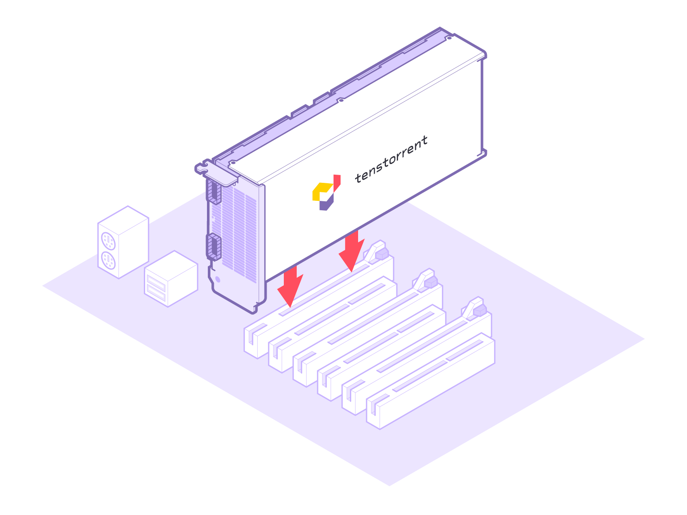
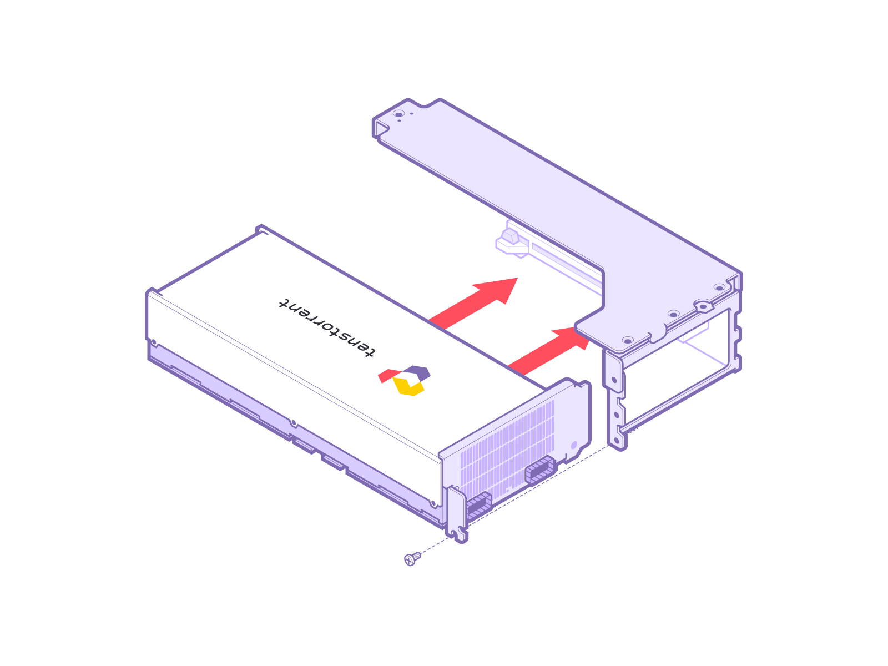
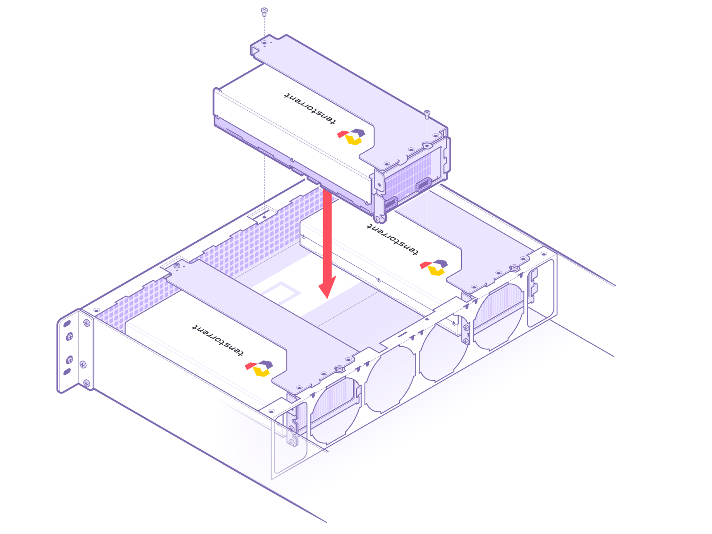

# Hardware Installation

Follow these instructions to install your Tenstorrent Wormhole™ n150d/n150s/n300d/n300s add-in board.

1. [Pre-Installation](#pre-installation)
2. System Installation
   - [Desktop Workstation](#desktop-workstation-installation)
   - [Server](#server-installation)
3. [Connecting Power](#connecting-power)
4. [Software Setup](#software-setup)

## Pre-Installation

1. **Disconnect power** to the host computer prior to installation.
2. Verify that the system provides the following:
   1. **PCI Express 4.0 x16 slot** 
      1. For optimal performance, the card requires a x16 configuration without bifurcation.
      2. The n150s and n300s are dual-slot width cards and will require the adjacent expansion slot to be vacant if you're using the Active Cooling Kit.
      3. The n150d and n300d are 2.5-slot width cards with axial fan coolers. Please ensure your chassis has sufficient airflow to exhaust the heat from these cards.
   2. One (1) **EPS12V 4+4-pin power connector**
3. Discharge your body's static electricity by wearing an **ESD wrist strap** *(recommended)* or touching a grounded surface before touching system components or the add-in card.

## Desktop Workstation Installation

*(NOTE: Images shown may not be fully representative of your system. n150s/n300s cards pictured; n150d/n300d will look different.)*

### Physical Installation

Insert the **card** into the **PCIe x16 slot** and secure with necessary screws.

## Server Installation (n150s/n300s Only)

*(NOTE: Images shown may not be fully representative of your system.)*

### 1. Attach Housing

House the **card** in the **casing**.

### 2. Card Installation

Lower the **encased card** into the **chassis** and secure with the required screws.

## Connecting Power

Connect an **4+4-pin EPS12V power cable** to the **8-pin plug**. *(NOTE: Do **not*** *connect a 6+2-pin PCIe power cable to the 8-pin port on the card.)*

## Software Setup

Instructions on how to set up software on your n150d/n150s/n300d/n300s are available [here](https://docs.tenstorrent.com/getting-started/README.html).
