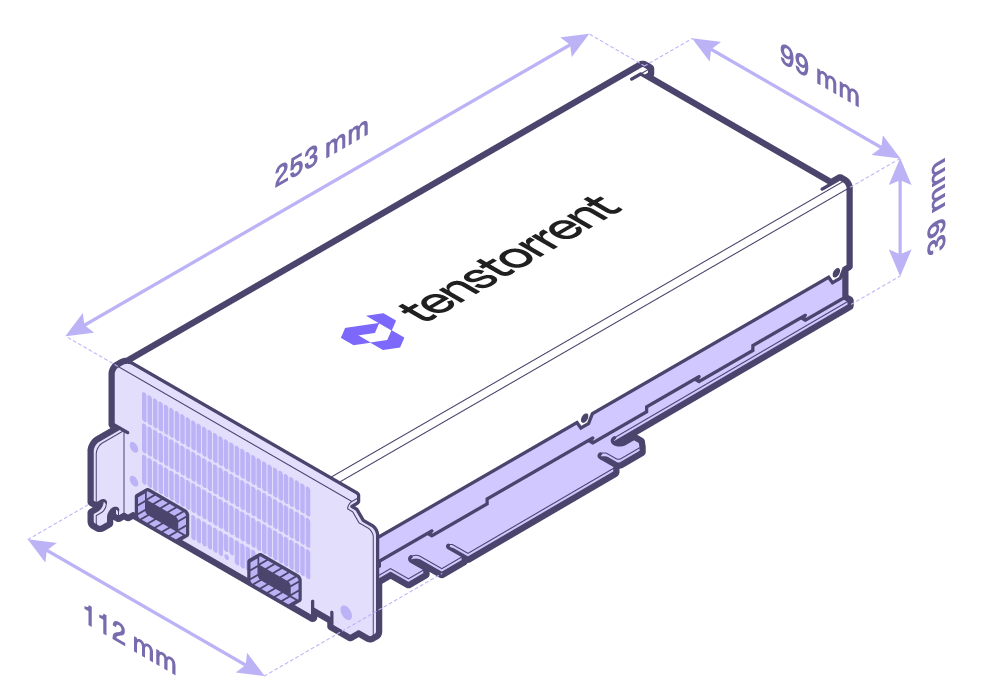

# Specifications/Requirements

## Wormhole™ Tensix Processor

The Wormhole™ n150d, n150s, n300d, and n300s Tensix Processor add-in boards are built using the Tenstorrent Wormhole™ Tensix Processor:

- **Tensix Core Count:** 80
- **SRAM:** 120 MB (1.5 MB per Tensix Core)
- **Memory:** 12 GB GDDR6, 192-bit memory bus

## Card Comparison Table

**NOTE:** The **n150s and n300s add-in cards** come with a heatsink for passive cooling in systems which can provide sufficient forced airflow to the card. If your system does not (for example, a desktop workstation), installing the bundled [Active Cooling Kit](../ack.md) is **required**; we strongly recommend desktop workstations use the **n150d** and **n300d** add-in cards which are designed for desktop deployment. If the card isn’t sufficiently cooled, performance will be substantially reduced to stay in a safe operating temperature range and you risk damage to the card.

| Specification                       | n150d                                             | n150s                                             | n300d                                             | n300s                                             |
| ----------------------------------- | ------------------------------------------------- | ------------------------------------------------- | ------------------------------------------------- | ------------------------------------------------- |
| Part Number                         | TC-02002                                          | TC-02001                                          | TC-02004                                          | TC-02003                                          |
| Wormhole™ ASICs                     | 1                                                 | 1                                                 | 2                                                 | 2                                                 |
| Tensix Cores                        | 72                                                | 72                                                | 128 (64 per ASIC)                                 | 128 (64 per ASIC)                                 |
| AI Clock                            | 1 GHz                                             | 1 GHz                                             | 1 GHz                                             | 1 GHz                                             |
| SRAM                                | 108 MB                                            | 108 MB                                            | 192 MB (96 MB per ASIC)                           | 192 MB (96 MB per ASIC)                           |
| Memory                              | 12 GB GDDR6                                       | 12 GB GDDR6                                       | 24 GB GDDR6                                       | 24 GB GDDR6                                       |
| Memory Speed                        | 12 GT/sec                                         | 12 GT/sec                                         | 12 GT/sec                                         | 12 GT/sec                                         |
| Memory Bandwidth                    | 288 GB/sec                                        | 288 GB/sec                                        | 576 GB/sec                                        | 576 GB/sec                                        |
| TeraFLOPS (FP8)                     | 262                                               | 262                                               | 466                                               | 466                                               |
| TeraFLOPS (FP16)                    | 74                                                | 74                                                | 131                                               | 131                                               |
| TeraFLOPS (BLOCKFP8)                | 148                                               | 148                                               | 262                                               | 262                                               |
| TBP (Total Board Power)             | 160W                                              | 160W                                              | 300W                                              | 300W                                              |
| External Power                      | 1x 4+4-pin EPS12V                                 | 1x 4+4-pin EPS12V                                 | 1x 4+4-pin EPS12V                                 | 1x 4+4-pin EPS12V                                 |
| Connectivity                        | 2x Warp 100 Bridge 2x QSFP-DD 200G (Active)* | 2x Warp 100 Bridge 2x QSFP-DD 200G (Active)* | 2x Warp 100 Bridge 2x QSFP-DD 200G (Active)* | 2x Warp 100 Bridge 2x QSFP-DD 200G (Active)* |
| Internal Chip-to-Chip               | N/A                                               | N/A                                               | 200G                                              | 200G                                              |
| System Interface                    | PCI Express 4.0 x16                               | PCI Express 4.0 x16                               | PCI Express 4.0 x16                               | PCI Express 4.0 x16                               |
| Cooling                             | Active (Axial Fan)                                | Passive                                           | Active (Axial Fan)                                | Passive                                           |
| Dimensions (WxDxH)                  | 52.2mm x 256mm x 111mm                            | 36mm x 254mm x 111mm                              | 52.2mm x 256mm x 111mm                            | 36mm x 254mm x 111mm                              |
| Dimensions (w/ Cooling Kit) (WxDxH) | N/A                                               | 36mm x 393.5mm x 114mm                            | N/A                                               | 36mm x 393.5mm x 114mm                            |

**For connecting to Tenstorrent Wormhole™-based cards only.*

*n150s/n300s without Active Cooling Kit*

## Connectivity

Wormhole™ cards include two different methods for interconnecting cards. *(n150s/n300s pictured; n150d and n300d will have the same ports and bridges.)*

The Warp 100 notches are for attaching internal [Warp 100 bridges](..\warp100.md) between Wormhole™ cards.

The two QSFP-DD ports are active and support 200G connectivity between cards and/or Wormhole™-based systems/servers.

## Data Precision Formats

The Wormhole™ Tensix Processor supports the following data precision formats:

| Format               | Bit Depth                                   |
| -------------------- | ------------------------------------------- |
| Floating point       | FP8, FP16, BFLOAT16 FP32 (Output Only) |
| Block floating point | BLOCKFP2, BLOCKFP4, BLOCKFP8                |
| Integer              | INT8 INT32 (Output Only)               |
| Unsigned Integer     | UINT8                                       |
| TensorFloat          | TF32                                        |
| Vector               | VTF19, VFP32                                |

## Minimum System Requirements

| Part                              | Requirement                                                  |
| --------------------------------- | ------------------------------------------------------------ |
| CPU                               | x86_64 architecture*                                         |
| Motherboard                       | PCI Express 4.0 x16 slot Dual-slot-width (n150s/n300s) 2.5-slot-width (n150d/n300d) |
| Memory                            | 64 GB                                                        |
| Storage                           | 100 GB (≥2 TB recommended)                                   |
| Power Connectors                  | 4+4-pin EPS12V 6+2-pin PCIe (if using Active Cooling Kit) |
| Total Board Power                 | Up to 160W (n150d/n150s) / 300W (n300d/n300s)                |
| Operating Temperature Range (Die) | 0C - 75C                                                     |
| Operating System                  | Ubuntu version 22.04 (Jammy Jellyfish) **                    |
| Internet Connection               | Required for driver and stack installation.                  |

** CPU core count and number of sockets will depend on the amount of host preprocessing and post-processing required before and after the accelerator processing.*

***To check your version, type* `cat /etc/os-release`.

## Environment Specifications

The Wormhole™ Tensix Processor add-in boards are designed to meet these environmental specifications:

| Specification                         | Requirement               |
| ------------------------------------- | ------------------------- |
| Operating Temperature Range           | 10°C/50°F - 35°C/95°F     |
| Storage Temperature Range             | -40°C/-40°F - 75°C/167°F  |
| Elevation                             | -5 ft. to 10,000 ft.      |
| Air Flow (without Active Cooling Kit) | ≥30 CFM @ up to 35°C/95°F |

