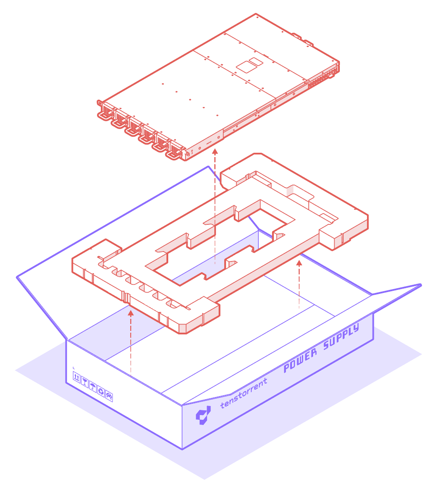
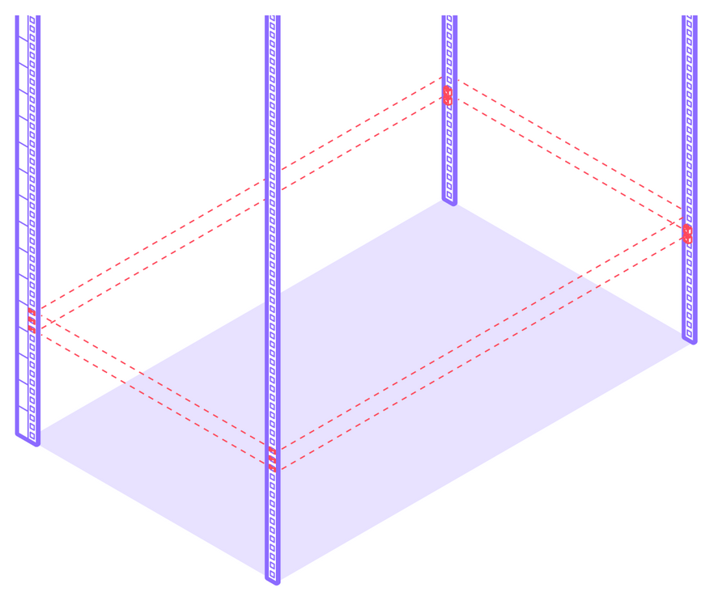
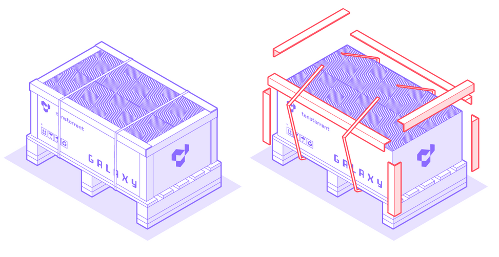
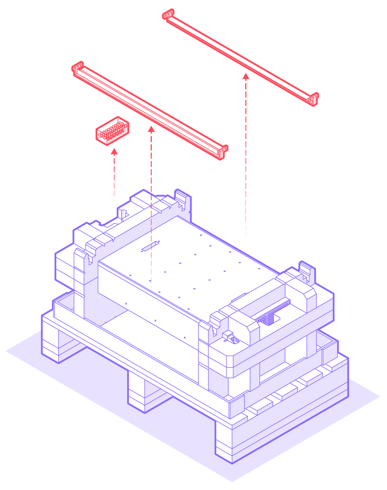
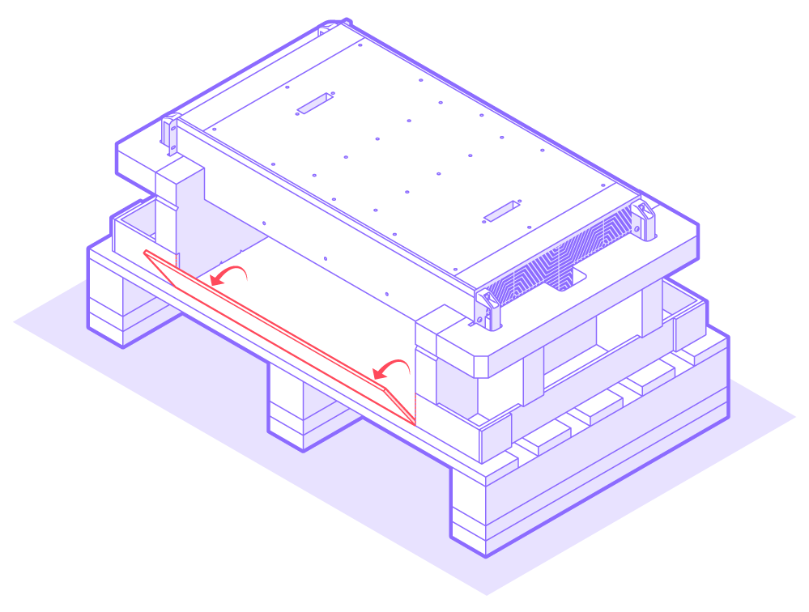
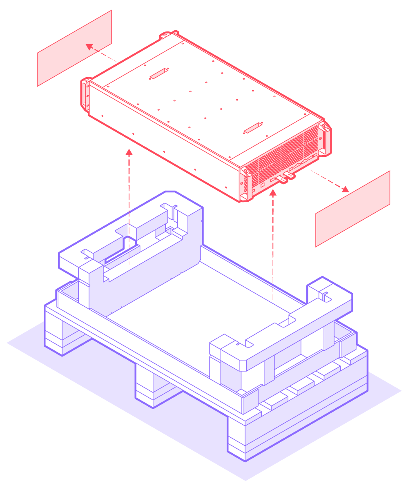
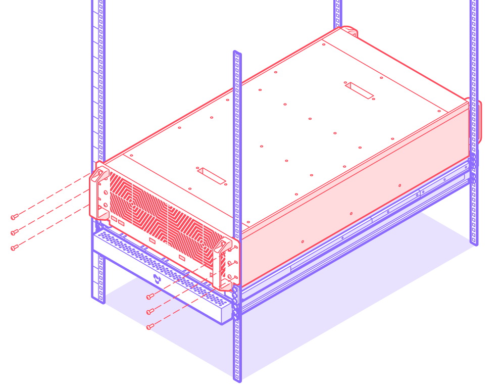
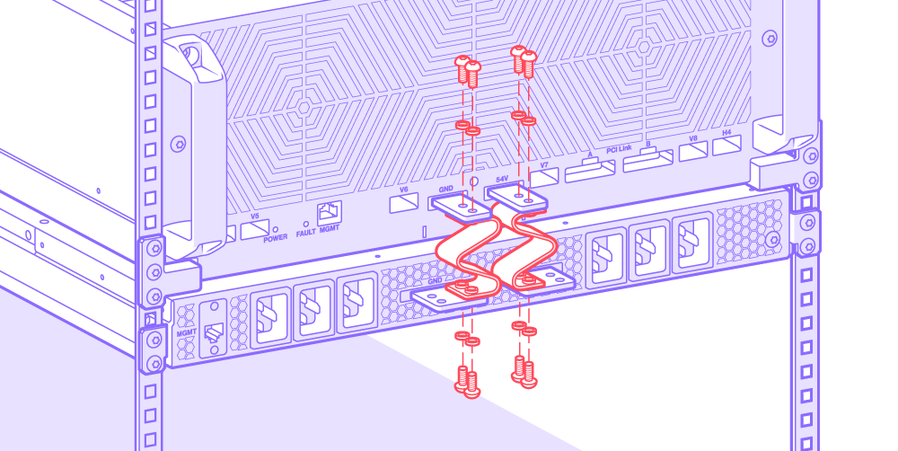

# Hardware Installation

The Galaxy Wormhole 4U Server(s), Galaxy Wormhole Power Supply, and Tenstorrent T7000 4U Workstation used as a host PC are designed to be installed on a **19"** rack. We recommend mounting the Galaxy Wormhole Power Supply prior to installing Galaxy Wormhole 4U Server(s).

This guide covers installation in this order:

1. [Unpack and rack mount Galaxy Wormhole Power Supply](#unpack-and-rack-mount-galaxy-wormhole-power-supply)
2. [Unpack and rack mount Galaxy Wormhole 4U Server(s)](#unpack-and-rack-mount-galaxy-wormhole-4u-server)
3. [Install bus bars](#install-bus-bars)
4. [Networking management installation](#networking-management-installation)

## Unpack and Rack Mount Galaxy Wormhole Power Supply

Please exercise care in unboxing and installing the Galaxy Wormhole Power Supply as it is **70 lbs. (32 kg)**.

### Unpacking

1. Open box at top.
2. Remove mounting shelves and power cables.

3. Remove installation kit and foam.

4. Remove Galaxy Wormhole Power Supply.

### Rack Mount

1. Install **10 M6 cage nuts** (6 in front face, 4 in back face) into desired 19" 1U rack slot. Ensure at least 4U is available above for mounting Galaxy Wormhole 4U Server system. *(If installing a second Galaxy Wormhole 4U Server, allow at least 4U below the power supply.)*

2. Attach shelves using the installed cage nuts and **eight (8) M6x16 T30 Torx screws**.

3. Slide Galaxy Wormhole Power Supply on to shelf.
4. Attach Galaxy Wormhole Power Supply to rack using **two (2) M6x16 T30 Torx screws**. Remove the top two (2) M6 shelf screws from front face (one on each side). Attach Tenstorrent cosmetic cover to rack using those screws.

## Unpack and Rack Mount Galaxy Wormhole 4U Server

The total weight of the Galaxy Wormhole 4U Server is **130 lbs. (59 kg)**, so it is strongly recommended that either two people or a Server Lift place the Galaxy Wormhole 4U Server on the rack.

### Unpack

1. Remove the stretch wrap surrounding the box.
2. Cut the straps and remove the edge protectors.

3. Remove top cover.

4. Remove shelves and accessory box.

5. Remove foam caps.

6. If using a Server Lift, tear box along perforations. Otherwise, have at least two people lift the unit from the box. The handles on the front and rear of the unit are secure and can be used to lift it.

7. Remove release liner.

### Rack Mount

Rack mounting instructions are given based on a single Galaxy Wormhole 4U Server mounted above the Galaxy Wormhole Power Supply. If mounting a second Galaxy Wormhole 4U Server, it should be mounted *below* the Galaxy Wormhole Power Supply.

1. Attach **three (3) M6 cage nuts** to each corner (12 total), then mount shelves to cage using **12 M6x16 T30 Torx screws**.

2. Slide Galaxy Wormhole 4U Server system into rack on shelves, then secure with **six (6) M6x16 T30 Torx screws** and **six (6) M6 cage nuts**.

## Install Bus Bars

This step must be performed after the Galaxy Wormhole 4U Server(s) and Galaxy Wormhole Power Supply have been mounted to the rack. You will need a torque screwdriver for this task.

### WARNING: Bus Bar Safety

These external bus bars are used to connect and power the Galaxy Wormhole 4U Server(s). Care must be taken to ensure these bars are not powered during installation or service, and the included bus bar covers must be used while the Galaxy Wormhole 4U Server(s) and Galaxy Wormhole Power Supply are in operation.

### WARNING: Belleville Washer Assembly

When installing bus bars, washers must be placed between the screws and bus bars with the **conical side facing up** as shown below.

### For Single Galaxy Wormhole 4U Server

1. Locate **nine (9) M5x10 T25 Torx screws**, **eight (8) M5 Belleville washers**, **lower bus bars**, and the **top bus bar cover**.
2. Mount bus bars using **Torx screws** and **Belleville washers** using a torque screwdriver with **6.2 Nm** torque.

3. Attach top bus bar cover with **one Torx screw** using a torque screwdriver with **1 Nm** torque.

### For Dual Galaxy Wormhole 4U Servers

1. Locate **18 M5x10 T25 Torx screws**, **16 M5 Belleville washers**, **upper bus bars**, **lower bus bars**, and the **bus bar covers**.
2. Mount bus bars using **Torx screws** and **Belleville washers** using a torque screwdriver with **6.2 Nm** torque.

3. Attach **bus bar covers** with **two (2) Torx screws** using a torque screwdriver with **1 Nm** torque.

## Networking Management Installation

### Management Port for Host

The Galaxy Wormhole 4U Server(s) will need to be managed by a Tenstorrent T7000 4U Workstation. A standard 1GbE RJ45 Ethernet jack is available on the T7000 for BMC (Baseboard Management Controller) connections. This jack should be connected to the same network as the BMC monitoring solution for the data center but is not required for Tenstorrent software.

### Management Port for Galaxy

The Galaxy Wormhole 4U Server includes a single 1GbE RJ45 Ethernet jack and should be connected to the same network as the Tenstorrent monitoring/control software.

### Management for Power Supply

The Galaxy Wormhole Power Supply includes a single 1GbE RJ45 Ethernet jack for command and control and should be on the same network as the Tenstorrent monitoring/control software.

### Public Access to Host

Two 200GbE QSFP-DD ports are available on the Tenstorrent T7000 4U Workstation being used as the host. These are provided via a high-speed NIC add-in card in the system. Selection of cable type – active or passive – is up to the network architect for the data center.

Please refer to the web page of the card vendor for a list of supported cables and modules: http://www.mellanox.com/products/interconnect/cables-configurator.php.